# Slide 데이터 흐름 (레거시)

## 1. 컴포넌트 구조

## 2. 읽기 흐름 (Read Flow)

## 3. 쓰기 흐름 (Write Flow)

## 4. 슬라이드 전환 흐름

## 5. Context 내부 상태 관리

```mermaid
stateDiagram-v2
    [*] --> Initialized: SlideProvider 마운트<br/>initialSlide로 초기화

    Initialized --> ScriptEditing: updateScript(text)
    ScriptEditing --> ScriptEditing: 계속 입력
    ScriptEditing --> HistorySaved: saveToHistory()<br/>(blur 시)

    HistorySaved --> ScriptEditing: 다시 편집
    HistorySaved --> Restored: restoreFromHistory(item)

    Restored --> ScriptEditing: 복원된 내용 편집

    Initialized --> TitleEditing: updateSlide({title})
    TitleEditing --> Initialized: 저장 완료

    Initialized --> OpinionUpdated: deleteOpinion() / addReply()
    OpinionUpdated --> Initialized

    Initialized --> [*]: 다른 슬라이드로 전환<br/>(Provider 언마운트)
```

## 6. 데이터 구조

## 7. 컴포넌트별 Context 사용

## 요약

| 구간                       | 방식     | 설명                            |
| -------------------------- | -------- | ------------------------------- |
| SlidePage → SlideWorkspace | Props    | 선택된 slide 객체 전달          |
| SlideWorkspace 내부        | Context  | useSlide() 훅으로 접근          |
| 슬라이드 전환              | key prop | Provider 재생성으로 상태 초기화 |
