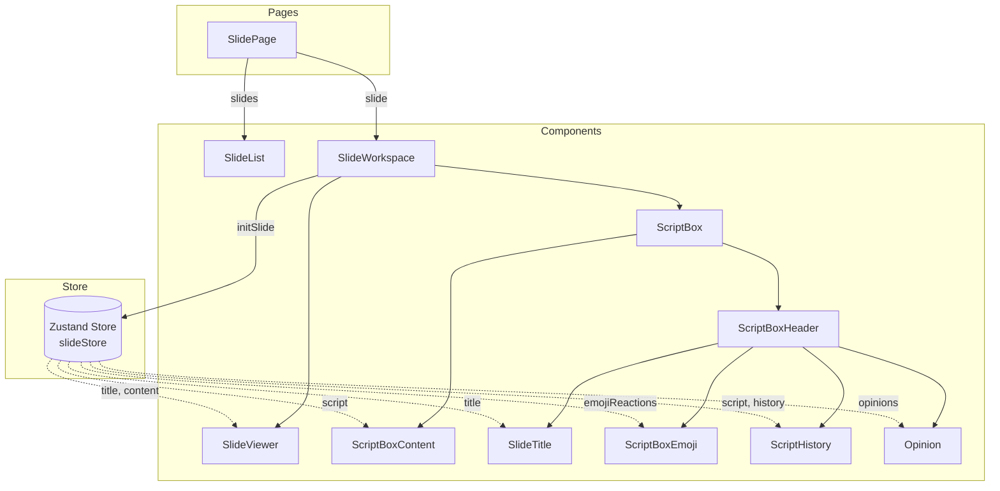
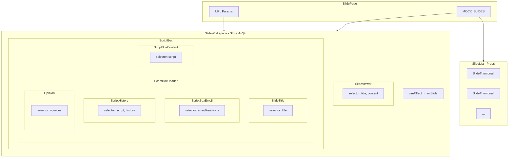
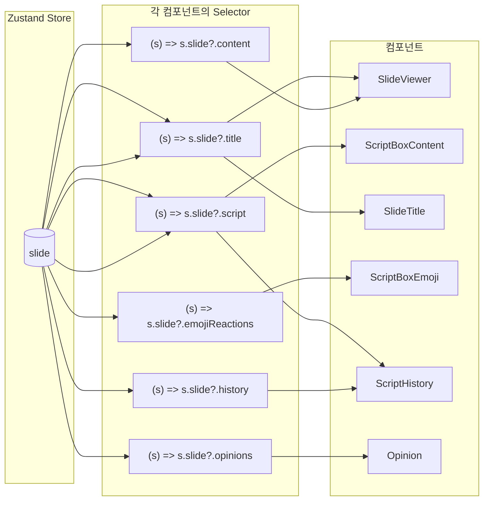
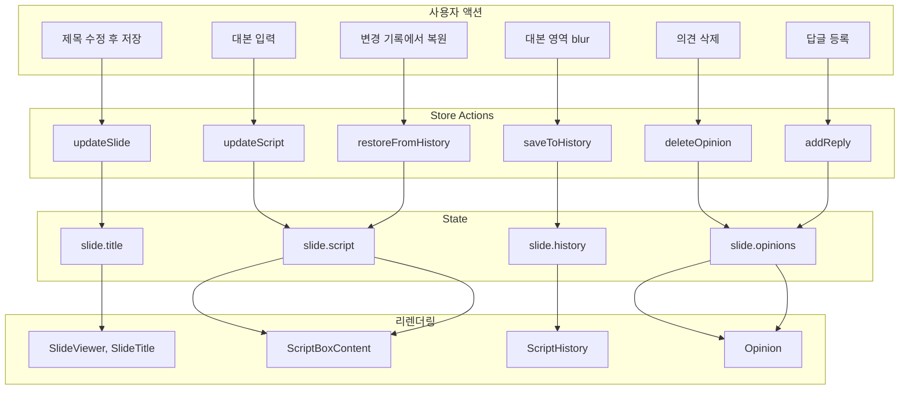
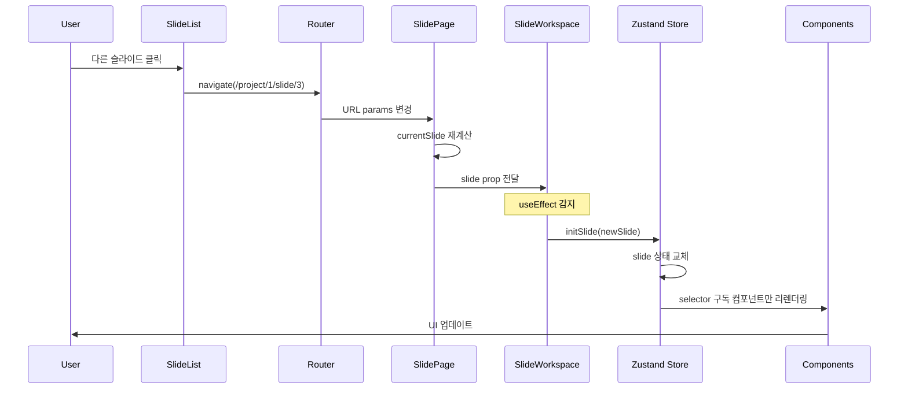
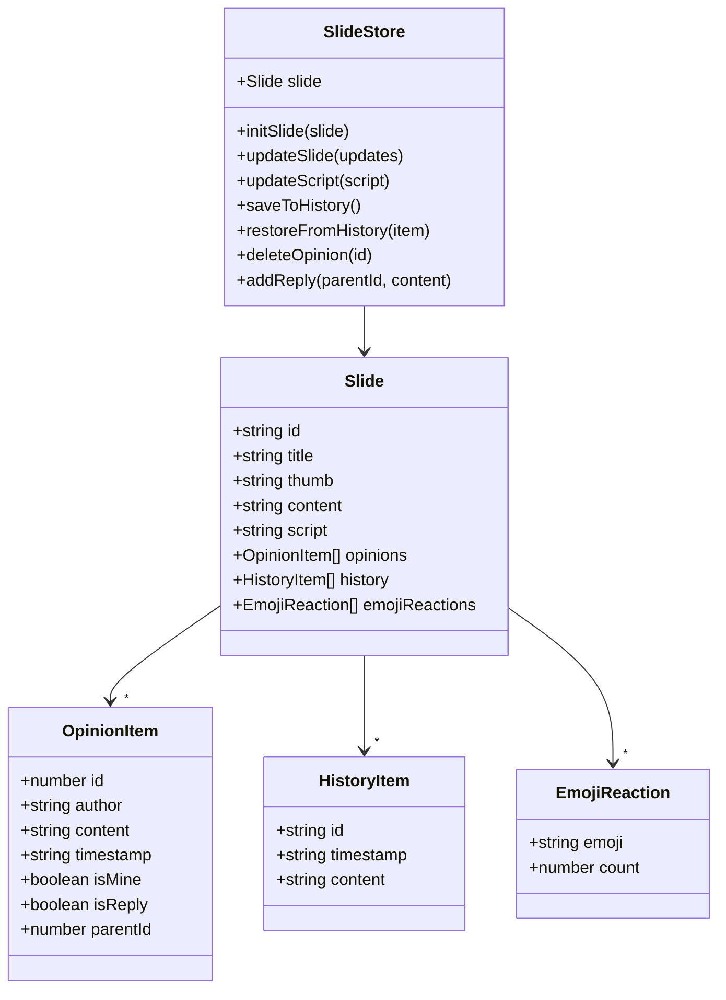
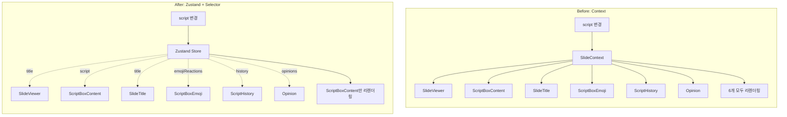

# Slide 데이터 흐름

## 1. 전체 아키텍처

## 2. 컴포넌트 계층 구조

## 3. Selector 기반 구독 (리렌더링 최적화)

## 4. 쓰기 흐름 (Actions)

## 5. 슬라이드 전환 흐름

## 6. Store 구조

## 7. Context vs Zustand 비교

## 8. 컴포넌트별 Store 사용

| 컴포넌트         | 구독 데이터         | 사용 액션                       |
| ---------------- | ------------------- | ------------------------------- |
| SlideViewer      | `title`, `content`  | -                               |
| ScriptBoxContent | `script`            | `updateScript`, `saveToHistory` |
| SlideTitle       | `title`             | `updateSlide`                   |
| ScriptBoxEmoji   | `emojiReactions`    | -                               |
| ScriptHistory    | `script`, `history` | `restoreFromHistory`            |
| Opinion          | `opinions`          | `deleteOpinion`, `addReply`     |

## 요약

| 항목          | Before (Context)     | After (Zustand)         |
| ------------- | -------------------- | ----------------------- |
| 상태 관리     | SlideProvider        | slideStore              |
| 데이터 전달   | useSlide() 전체 구독 | selector로 필요한 것만  |
| 리렌더링      | 모든 Consumer        | 관련 컴포넌트만         |
| 슬라이드 전환 | key prop으로 재생성  | initSlide()로 상태 교체 |
| 디버깅        | React DevTools       | Zustand DevTools        |
